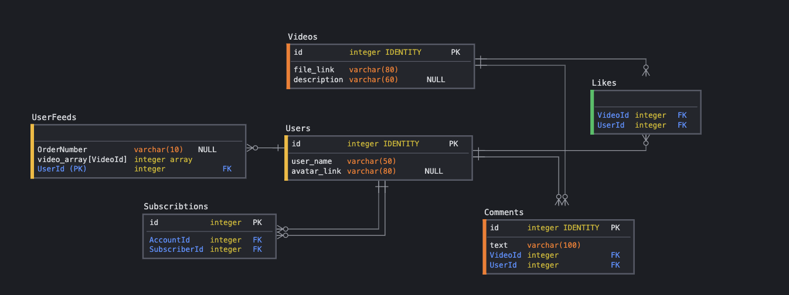

# highload_tiktok

# 1. Введение

## 1.1 Обзор темы

«ТикТок» (англ. TikTok) — сервис для создания и просмотра коротких видео, принадлежащий пекинской компании «ByteDance». Запущенная летом 2018 года международная версия является ведущей видеоплатформой для коротких видео в Китае и становится всё более популярной в других странах, став одним из наиболее быстрорастущих и скачиваемых приложений
60 млн пользователей

## 1.2 Целевая аудитория

Основная аудитория - жители Южной Азии. Всего - 60 млн пользователей. Подавляющая часть аудитории - люди в возрасте от 10 до 29 лет.

30 млн пользователей, загружающих видео (50%), пусть в среднем пользователь загружает 1 видео в месяц, т.е. ~ 30 млн загружаемых видео в месяц. Максимальная длина ролика - 1 минута.
В среднем пользователь проводит в «ТикТок» 52 минуты в день. Средняя длина ролика - 30 секунд. Активной аудиторией будем считать 60% пользователей, то есть 36 млн пользователей

Источники:

https://boosted.lightricks.com/tiktok-video-length-video-formatting-guide/#:~:text=At%20first%2C%20TikTok%20videos%20could,be%20longer%20than%2060%20seconds.

https://www.oberlo.com/blog/tiktok-statistics

https://news.cpa.ru/tiktok-showed-audience-statistics/

# 2. Расчет нагрузки

Будем считать активной аудиторией 60% от всех пользователей приложения, получаем 36 млн активных юзеров.

Рассчитаем нагрузку от отдого пользователя.

За минуту использования сайт сделал 252 запроса и загрузил 22.5 Мбайт данных. Из них запросы на видео - 18.2 Мбайт, запросы бизнес-логики 3.1 Мбайт, запросы за статическими файлами - 1.2 Мбайт

Расчитаем среднюю нагрузку в секунду (от одного пользователя):

22.5 * 8 / 60 = 3 Мбит/c

Из них:

    2.4  Мбит/c - видео

    0.44 Мбит/c - бизнес логика

    0.16 Мбит/c - стат. файлы

Расчитаем среднюю нагрузку в день (от одного пользователя):

В среднем пользователь проводит в «ТикТок» 52 минуты в день.

3 * 60 * 52 = 9360 Мбит

Из них:

    7488  Мбит - видео

    1372.8 Мбит - бизнес логика

    499.2 Мбит/c - стат. файлы

Расчитаем среднюю нагрузку  от всех пользователей:

9360 * 36000000 / 24 / 60 / 60 = 39 Гбит/с

Из них:

    31.2 Tбит/с - видео

    5.72 Tбит/с  - бизнес логика

    2.08 Тбит/с  - стат. файлы

Расчитаем объем хранилища для видео-файлов:

Максимальный размер видео для iOS - 287.6 Mбайт, для Android - 72 Mбайт. Предположим, что 70% пользователей используют приложение
с Android, расчитаем средний вес видео (длиной 60 секунд):

287.6 * 0.3 + 72 * 0.7 = 136.68 Mбайт

Отсюда средний вес одного видео (30 секунд): 68.34 Mбайт

Так как всего в месяц загружается 30 млн видео, можем расчитать общий объем необходимого хранилища:

68.34 * 30000000 = 1955.22 Тбайт

За минуту использования сайт сделал 252 запроса

Из них:

    54 - запросы за видео

    95 - запросы бизнес логики

    103 - запросы за стат. файлами

Рассчитаем среднее количество запросов в секунду:
252/60 * 36000000/(60*60*24) = 175 rps (при средней дневной аудитории в 36 млн)

Нагрузка то  дневной аудитории:

252/60 * 36000000/(60 * 52 * 24) = 2019 rps

# 3. Логическая схема

