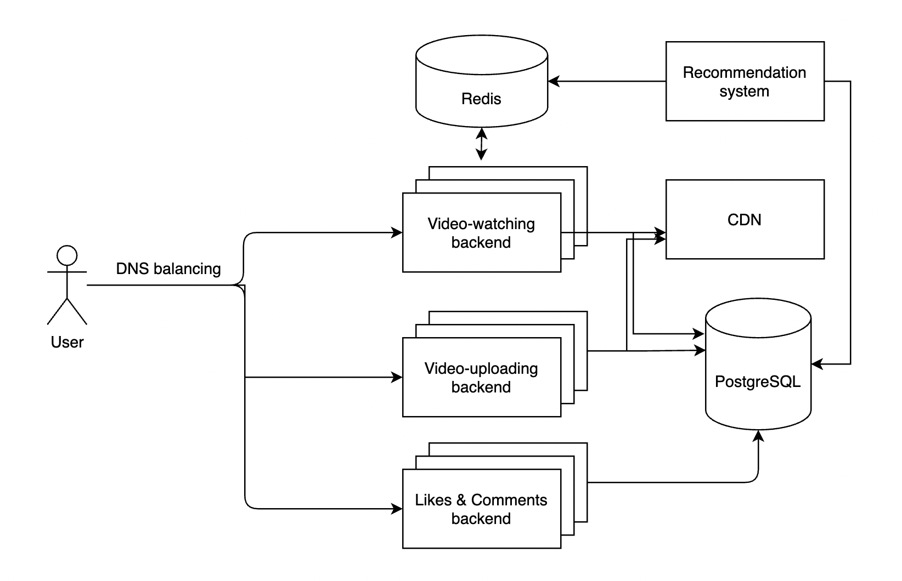

# 1. Введение

## 1.1 Обзор темы

«ТикТок» (англ. TikTok) — сервис для создания и просмотра коротких видео, принадлежащий пекинской компании «ByteDance». Запущенная летом 2018 года международная версия является ведущей видеоплатформой для коротких видео в Китае и становится всё более популярной в других странах, став одним из наиболее быстрорастущих и скачиваемых приложений
60 млн пользователей

## 1.2 Целевая аудитория

Основная аудитория - жители Poccии. Всего - 30 млн пользователей. Подавляющая часть аудитории - люди в возрасте от 10 до 29 лет.

* 15 млн пользователей, загружающих видео (50%), пусть в среднем пользователь загружает 1 видео в месяц, т.е. ~ 15 млн загружаемых видео в месяц.

* Максимальная длина ролика - 1 минута.

* В среднем пользователь проводит в «ТикТок» 52 минуты в день.

* Средняя длина ролика - 30 секунд.

* Ежедневной аудиторией будем считать 60% пользователей, то есть 18 млн пользователей.

* Среднее количество подписок - 50.

* Среднее количество лайков на видео - 80.

* Среднее количество комментариев на видео - 15.

Источники:

[1](https://boosted.lightricks.com/tiktok-video-length-video-formatting-guide/#:~:text=At%20first%2C%20TikTok%20videos%20could,be%20longer%20than%2060%20seconds)

[2](https://www.oberlo.com/blog/tiktok-statistics)

[3](https://news.cpa.ru/tiktok-showed-audience-statistics/)

# 2. Расчет нагрузки

Рассчитаем нагрузку от отдого пользователя.

За минуту использования сайт сделал 252 запроса и загрузил 22.5 Мбайт данных. Из них запросы на видео - 18.2 Мбайт, запросы бизнес-логики 3.1 Мбайт, запросы за статическими файлами - 1.2 Мбайт

Расчитаем среднюю нагрузку в секунду (от одного пользователя):

22.5 * 8 / 60 = 3 Мбит/c

Из них:

    2.4  Мбит/c - видео

    0.44 Мбит/c - бизнес логика

    0.16 Мбит/c - стат. файлы

Расчитаем среднюю нагрузку в день (от одного пользователя):

В среднем пользователь проводит в «ТикТок» 52 минуты в день.

3 * 60 * 52 = 9360 Мбит

Из них:

    7488  Мбит - видео

    1372.8 Мбит - бизнес логика

    499.2 Мбит - стат. файлы

Расчитаем среднюю дневную нагрузку от всех пользователей:

9360 * 18000000 / 24 / 60 / 60 = 1.95 Tбит/с

Из них:

    1.56 Tбит/с - видео

    0.29 Tбит/с  - бизнес логика

    0.10 Тбит/с  - стат. файлы

Расчитаем объем хранилища для видео-файлов:

Максимальный размер видео для iOS - 287.6 Mбайт, для Android - 72 Mбайт. Предположим, что 70% пользователей используют приложение
с Android, расчитаем средний вес видео (длиной 60 секунд):

287.6 * 0.3 + 72 * 0.7 = 136.68 Mбайт

Отсюда средний вес одного видео (30 секунд): 68.34 Mбайт

Так как всего в месяц загружается 15 млн видео, можем расчитать общий объем необходимого хранилища:

68.34 * 150000000 = 1025.1 Тбайт

За минуту использования сайт сделал 262 запроса

Из них:

    64 - запросы за видео

    95 - запросы бизнес логики

    103 - запросы за стат. файлами

Рассчитаем среднее количество запросов в секунду:
262 / 60 * 18000000/(60 * 60 * 24) = 909 rps (при средней дневной аудитории в 18 млн)

Пиковой будем считать нагрузку в 3 раза превосходящую среднюю дневную нагрузку = 2727 rps

Отдельно посчитаем нагрузку на запросы за рекомендованными видео.
ТикТок подгружает видео в ленту "пачками", формируя ленту рекомендаций заранее. Приложение делает запрос за рекомендации каждые 30 видео.
Так как в среднем человек смотрит 104 видео в день, делается всего 4 запросов за списком видео. Посчитаем среднее количество запросов в секунду:

    18000000 * 4 / ( 60 * 60 * 24) = 883 rps

Тогда в пике нагрузка на загрузку рекомендаций:

    883 * 3 = 2649 rps

# 3. Логическая схема
Так как система в основном нагружена именно на просмотр видео, разумно будет разумно создавать ленты рекомендованных 
видео заранее в отдельном сервисе. Этот сервис рекомендаций будет составлять список видео, который будет добавляться в in-memory 
хранилище по ключу - id пользователя. Получается, что в in-memory хранилище по id пользователя будем получать list, содержащий id рекомендованныx видео. Информацию о 30 последних рекомендованных видео так же сохраним в БД (таблица UserFeeds)

# 4 Физическая схема

Redis мы используем для хранения подготовленных для пользователя списков видео, предлагаемых к просмотру.

PostreSQL содержит данные о пользователях, информацию о видео, лайки, подписки.

CDN представляет собой распределенную систему из нескольких серверов.
Есть сервис гео-роутинга, который адресует пользователя к ближайшему файл-серверу с нужным пользователю видео.
Имеются "холодные" и "горячие" файл-сервера, которые объединены в общую сеть. Холодные сервера содержат 90% от общего кол-во видео ТикТока, в то время как горячие - только 10% популярных видео.

# 5 Нагрузка на БД

## 5.1 Redis
### UserId - Videos
"Таблица" содержит идентификатор пользователя и список идентификаторов видео, рекомендованных данному пользователю.
Рекомендательный сервис в день в среднем подбирает для каждого пользователя не менее 52 видео, возьмем с запасом, тогда
пусть для каждого пользователя в день подбирается 100 видео.

Нагрузка на запись:

    100 * 30 000 000 / (24 * 60 * 60) = 34722 rps

Чтение производится каждый раз, когда пользователь обращается за рекомендациями.

Нагрузка на чтение:

    18000000 * 4 / ( 60 * 60 * 24) = 883 rps

Строк в таблице:

    30 000 000

## 5.2 PostgreSQL

### 5.2.1 Users

Оценим годовой прирост пользователей нашего сервиса. Согласно [2](https://www.oberlo.com/blog/tiktok-statistics) за 18 месяцев
в 2019 число юзеров увеличились в 5.5 раз, возмем прирост в 3 раза, получим 60 млн новых пользователей.

Нагрузка на запись:

    60 000 000 / (365 * 24 * 60 * 60) = 1.9 rps

Информация о пользователе нужна при посещении его аккаунта, пусть в среднем пользователи просматривают 3 аккаунтов в день.

Нагрузка на чтение:

    18 000 000 * 3 / (24 * 60 * 60) = 625 rps

Строк в таблице:

    30 000 000

### 5.2.2 Subscriptions

Будем считать, что юзеры подписываются/отписываются на друг-друга 10 раз в месяц.

Нагрузка на запись:

    30 000 000 * 10 / ( 24 * 60 * 60 * 30) = 115.7 rps

Информация о подписках юзера скрыта, будем считать, что нагрузка на чтение мала.

Строк в таблице:

        30 000 000 * 50 = 1 500 000 000

### 5.2.3 UserFeeds
Таблица обновляется при каждом запросе юзера о рекомендациях, тогда
Нагрузка на запись:

        18000000 * 4 / ( 60 * 60 * 24) = 883 rps

Нагрузка на чтение пренебрежимо мала

Строк в таблице:

    30 000 000

### 5.2.4 Videos

Нагрузка на запись:

    15 000 000 / ( 60 * 60 * 24 * 30) = 5.7 rps

Информация о видео вычитывается из базы каждый раз, когда пользователей делает запрос за
рекомендованными видео.

Нагрузка на чтение:

    18000000 * 4 / ( 60 * 60 * 24) = 883 rps

Строк в таблице:
    
    15 000 000 * 12 = 180 000 000

### 5.2.5 Comments

Будем считать что юзер оставляет 2 комментария в день.

Нагрузка на запись:

    2 * 18 000 000 / ( 60 * 60 * 24) = 416 rps

Нагрузка на чтение:

Пусть пользователь заходит в комментарии каждого пятого видео.

    52 / 5 * 18 000 000 / (60 * 60 * 24) = 2166 rps

Строк в таблице:

    180 000 000 * 50 = 9 000 000 000

### 5.2.6 Likes

Нагрузка на запись:

Пусть пользователь лайкает 10 видео в день.

    10 * 18000000 / (60 * 60 * 24) = 2083 rps

Нагрузка на чтение:

Информация о количестве лайков содержится в таблице видео, нагрузка на чтение пренебрежима.

Строк в таблице:

    80 * 15 000 000  = 1 200 000 000

Расчитаем необходимый на год объем базы данных:

UserFeeds

    id(16) + userId(16) + video_array(800) = 832 байта
     30000000 * 832 = 24.96 Гбайт

Subscriptions

    id(16) + AccountId(16) + SubscriberId(16) = 48 байтов
    50 * 30000000 * 48 = 72 Гбайт

Users

    id(16) + user_name(20) + metadata(20) + avatar_link(80) = 132 байта
    30000000 * 132 = 3.96 Гбайт

Videos

    id(16) + file_link(80) + fideo_title(80) + author_name (20) + likes_count(8) + meta_data(80) = 284 байта
    284 * 15000000 * 12 = 51.12 Гбайт

Comments

    id(16) + text(100) + VideoId(16) + UserId(16) = 148 байтов
    15000000 * 12 * 15 * 148 = 399.6 Гбайт

Likes

    id(16) + VideoId(16) + UserId(16) = 48 байтов
    15000000 * 12 * 80 * 48 = 691.2 Гбайт

    Итого: 691.2 + 399.6 + 51.12 + 3.96 + 72 + 24.96 = 1242.84 Гбайт

Расчитаем объем Redis c рекомендованными видео:

Так как в среднем каждый день пользователь проводит в ТикТок 52 минуты, а среднее видео длится 30 секунд,
будем считать, что в день пользователь в среднем смотрит 64 видео, округлим до 70 - очередь видео такой длиной 
должна содержаться в Redis для каждого пользователя.

Одна пара ключ-значение:
    id(16) + list(8) + 70 * video_id(16) = 2649 байта
Общий объем хранилища
    2649 * 30 000 000 = 79,47 Гбайт

## 5.3 Итоги

**PostgreSQL**

| Table            | Write RPS   | Read RPS   | Строки     | Общий объем (1 год) |
| ------| ----------- |----------- |----------- |----------- |
| UserFeeds       | 883        |     |30 000 000       |24.96 Гбайт  |
| Subscriptions   | 115.7      |     |1 500 000 000    |72 Гбайт     |
| Users           | 1.9        | 625 |30 000 000       |3.96 Гбайт   |
| Videos          | 5.7        |883  |180 000 000      |51.12 Гбайт  |
| Comments        | 416        |2166 |9 000 000 000    |399.6 Гбайт  |
| Likes           | 2083       |     |1 200 000 000    |1242.84 Гбайт|

**Redis**

| Table            | Write RPS   | Read RPS   | Строки     | Общий объем (1 год) |
|-------|----------|-------------|----------|----------- |
| UserId - Videos     | 34722       | 883|30 000 000       |79,47 Гбайт  |

Видим, что одного инстанса Redis на 1 CPU нам будет вполне достаточно.
А вот общая нагрузка на PostgreSQL - 7179,3 rps, общий объем на год - 1,7 Tбайт. 
Один инстанс PostgreSQL выдерживает 500 rps, значин нам понадобится 16-ти ядерный компьютер под БД.
Так как основная нагрузка идёт не на базу данных, шардировать БД смысла нет.

# 6 Выбор технологий

IOS клиент будет написан на Swift так как это рекомендуемый Apple язык разработки под IOS. Android клиент будет написан на Kotlin так как это рекомендуемый Goolge язык разработки под Android.

Бекенд: Golang, так как он удобен для написания микросервисов (взаимодейтсвие можно осуществлять по протоколу grpc), имеет возможность благодаря горутинам эффективно реализовывать параллелизм.

Сервис рекомендаций задействует алгоритмы ML, удобнее всего будет использовать быстрый для разработки Python

Взаимодействие по HTTP2

# 7. Расчёт оборудования и расположения

## 7.1 Video-watching backend

Пиковая нагрузка на загрузку рекомендаций 2649 rps. Допустим, что бэкенд-сервер на голанг имеет производительность 4000 rps.
Достаточно будет одного сервера, но для надежности возьмем 3 сервера, а так же 3 сервера-дублера.
Установим сервера в Москву, Петербург и Екатеринбург по 2 штуки. Таким образом, при отказе одного сервера, нагрузка переключится на сервер-дублер, а при выходе из строя обоих машин, нагрузка перейдет на оставшиеся 4 сервера. В теории, даже один из них способен процессировать все запросы, но будет задержка ответа географического характера.

## 7.2 Video-uploading backend

Будем отталкаваиться от максимальной пиковой нагрузки - 2727. Конфигурация идентична Video-watching backend

## 7.3 Likes&Comments Backend

Будем отталкаваиться от максимальной пиковой нагрузки - 2727. Конфигурация идентична Video-watching backend

## 7.4 Recommendation system

По rps нам подходит предыдущая конфигурация, но так как в системе рекомендаций много ML-расчетов, мы получим 
большую нагрузку RAM и CPU. Поставим 5 машин с 32  CPU и 128 Гб RAM.

## 7.5 PostgreSQL

Общая нагрузка на PostgreSQL - 7179,3 rps, общий объем на год - 1,7 Tбайт. 
Один инстанс PostgreSQL выдерживает 500 rps, значин нам понадобится 16-ти ядерный компьютер под БД с 4 Tбайт памяти.

## 7.6 Redis

Нагрузка на Redis - 35555 rps. Допустим, что инстанс Redis выдерживает нагрузку в 100 000 rps. Ограничение по памяти - 80Гб.
Хватит машины с 4 СPU, 128 Гб RAM.

## 7.7 CDN

При пиковом онлайне (50% дневной аудитории) общая пропускная способность:
    0.5 * 18 000 000 * 2.4 = 21.6 Тбит/с
С использованием двух сетевых карт на 50 Гбит/с потребуется
    21600 / (50 * 2) = 216 серверов

Для надежности и меньшей латенси возьмем 400 серверов. 300 будут содержать "Холодный контент", остальные 100 - "горячий".
На каждом "горячем" сервере предлагается дублировать все "горячие" видео. Для холодных видео - будем записывать их в 3 из 300 серверов, выбираем по хешу от названия видео, затем по модулю от 100.

Распределить сервера необходимо согласно плотности пользователей в России: 70 процентов машин выделим на Москву и Петербург, 10 процентов на Екатеринбург, оставшиеся серверы равномерно на города-миллионники (Новосибирк, Красноярск, Волгоград, Уфа и тд) так, чтобы они были примерно равноудалены.

Балансировка запросов в CDN осуществляется с помощью гео-роутинга- модуля, который который хранит таблицу адресов, для маппинга видео и локации файловых-серверов.

За год в ТикТок загружается 180 000 000 видео, в среднем один ролик весит 68.34 Mбайт. Видео будем делить на популярные и непопулярные. 90% контента будет храниться в хранилище на HDD. Объем хранилища на год:
    180000000 * 68.34 * 0.9 = 11.071 Пбайт
Актуальные видео (10%) будут храниться на SSD дисках. Если считать, что видео актуально около 2 недель, то всего на SSD должно
помещаться 7.5 млн видео, округлим до 8 млн, тогда минимальный объем SSD хранилища:
    7500000 * 68.34 * 0.1 = 51.255 Tбайт
Файловые сервера разделим на сервера актуального контента - 100 штук, остальные на холодный контент, посчитаем хранилища для 
серверов актуального контента:
    51.255 / 100 = 5.1 Tбайт
Следовательно, каждой машине поставим SSD диски на 6 Тбайт.

Для серверов холодного контента:
    11.071 / 300 = 37 Tбайт 
Следовательно, каждой машине поставим HDD диски на 40 Тбайт.

## 7.8 Итоги

| Сервер                           | CPU   | RAM | SSD, Гб  | HHD, Гб    | Сеть | Кол-во         | География |
|-----------------                 |-------|-----|----------|------------|------|--------------|-------------------|
| Redis                            |    4  | 128 |  64      |  64        | 2 х 10 Гб/с     |   4       | Москва, Петербург |
| Video-watching backend           |   4   | 16 |   128    |  64         | 2 х 10 Гб/с      | 3 + 3    | Москва, Петербург, Екатеринбург |
| Video-uploading backend          |   4   |16  |   128    |  64         | 2 х 10 Гб/с      | 3 + 3    | Москва, Петербург, Екатеринбург |
| Likes&Comments Backend           |   4   | 16  |  128    |  64         | 2 х 10 Гб/с      | 3 + 3    | Москва, Петербург, Екатеринбург |
| Recommendation system            |   32  |  128|  128    |  64         | 2 х 10 Гб/с      | 5        | Москва, Петербург, Екатеринбург |
| PostgreSQL                       |   16  |  16 |  0      |  4000       | 2 х 10 Гб/с      | 1        | Москва |
| Модули CDN с популярным контентом|  8    |  16 |  6000   |  64         | 2 х 50 Гб/с   | 100       | Описано в 7.7 |
| Модули CDN с холодным контентом  |   8 |   16  |  0      |  40000      | 2 х 50 Гб/с   | 300       | Описано в 7.7 |

# 8. Cхема проекта

*User* - клиент, обращающийся к нашему сервису. Чаще всего мобильное приложение.

*Nginx* - фронтенд-сервер, выполняющий роль отдачи статики и балансировщика нагрузки.

*Video-watching backend* - бекэнды, отвечающие за доставку видео-файлов юзеру.

*Video-uploading backend* - бекэнды, отвечающие за размещение видео, отправленного пользователем в CDN

*Likes&Comments Backend* - бекэнды, отвечающие за подписки, комментирование и другие действия пользователя

*Recommendation system* - система, анализирующая предпочтения пользователя и составляющая рекомендации

